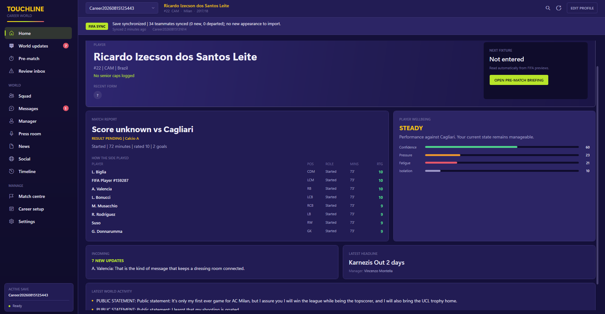
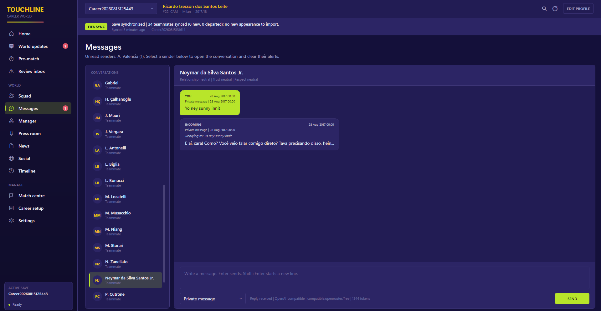

# Touchline - FIFA 18 AI Career Companion

Touchline is a Windows desktop companion for FIFA 18 Player Career Mode. FIFA remains the authority for matches, statistics, transfers, tables, and selection; Touchline reads Player Career save files without modifying them, stages detected results for review, and builds a persistent world of teammates, managers, press, news, social reactions, relationships, memories, and emerging narratives around imported facts.

## Screenshots





## Technology and architecture

The application uses .NET 9 and WPF for a native Windows experience, SQLite for a durable local career world, and the OpenAI Responses API for optional structured character dialogue. This choice keeps installation straightforward, permits future Windows-process integration, and provides clear separation between UI, application services, domain simulation, data providers, and persistence.

```text
CareerCompanion.App (WPF UI)
        |
Application services / deterministic simulation / LLM orchestration
        |
ICareerDataProvider -> ManualCareerDataProvider / Fifa18SaveCareerDataProvider
        |
SQLite career-world.db
```

The app owns facts, state, chronology, relationships, memory, bounds, and event significance. The model supplies language and interpretation. Stored information is classified as `HistoricalFact`, `SaveFact`, or `SimulatedInterpretation`; model output cannot rewrite a match or promote fiction to a FIFA save fact.

## Included V1 systems

- First-run fictional demonstration career and manual career creation
- Read-only FIFA 18 Player Career save discovery, including OneDrive-redirected Documents folders
- Startup synchronization and a self-healing save-folder watcher with career routing by FIFA player ID
- Persistent match-review inbox, career linking, dismissal history, chronological safety checks, and idempotent provider match storage
- Automatic teammate reconciliation by stable FIFA player ID, with transfers and departures preserved in character history
- Automatic verified manager and agent creation, replacement reconciliation, FIFA Wire news import, international call-up and appearance detection, progression snapshots, and club or country fixture detection
- Quick squad/manager/journalist entry; structured profile editing and JSON import/export
- Fast post-match form and deterministic win/loss/draw, scoring, card, streak, derby, major-fixture, heavy-defeat, and late-winner events
- Separate club and international match context, including representing team, senior caps, international goals and assists, debut milestones, and country-specific press and reactions
- Match history with factual corrections, regenerated world effects, and guarded deletion for manually logged matches
- Importance heuristics, selective reaction targeting, silence for minor events, and narrative emergence/decay
- Multi-dimensional bounded relationships and validated model deltas
- Per-character memory persistence, relevance ranking, and conservative compression architecture
- Automatic incoming teammate and manager reactions, stateful characters, an unread World Updates inbox, and sender-aware navigation
- Numeric red unread badges for World Updates and Messages, with automatic sender selection when opening a message notification
- Persistent player confidence, pressure, fatigue, isolation, and resilience, with context-sensitive emotional impact after defeats
- Relationship-aware private support after severe losses, plus player-controlled recovery, training, and opening-up responses
- Persistent automatic-generation jobs that show an immediate offline fallback and rewrite it with character-aware LLM dialogue when an API key is available
- Scene-aware messages, manager and agent conversations, conditional multi-question post-match interviews with grounded AI follow-ups and offline fallback, and consequential public statements
- Statement-aware manager and teammate follow-ups for accountable, team-first, boastful, critical, or referee-focused interview answers
- Automatic pre-match manager briefings and teammate messages, with opposition key players, manager, venue, and rivalry context read from the FIFA save when available
- Transfer-request detection with manager, teammate, and agent conversations, plus transfer coverage, agent guidance, and deduplicated squad arrival or departure storylines
- Differentiated offline news outlets and social personas
- Dated football record catalogue covering 2017/18-era UEFA Champions League, Premier League, LaLiga, Portugal international, scoring-streak, and rare five-goal milestones; verified breakthroughs create a timeline event, red notification, and agent reaction
- Career dashboard, chronological timeline, settings, debug inspector, and DPAPI-protected API keys
- Consistent SQLite export/restore backup
- OpenAI Responses API provider with strict JSON Schema, timeout/rate-limit/network/malformed-output handling
- Usage token logging, configurable model routing and generation switches
- A deterministic bulk simulator and automated tests

## Requirements

- Windows 10/11
- [.NET 9 SDK](https://dotnet.microsoft.com/download/dotnet/9.0) for development; a self-contained publish does not require a separate runtime

## Development and run

```powershell
dotnet restore RPSystem.slnx
dotnet run --project src/CareerCompanion.App/CareerCompanion.App.csproj
```

On first launch, a small career named **Touchline Demo (Fictional)** is created so all offline screens can be evaluated immediately. Create your real save under Career.

## FIFA 18 automatic sync

Open **Career** and use the **Automatic FIFA 18 Sync** card. Touchline discovers the newest `Career*` file under the FIFA 18 settings directory. Enable the watcher to scan again after FIFA writes a save, or use **Scan newest save** at any time.

On the first scan, Touchline stages the detected FIFA save as a pending link. During automatic startup or watcher scans, it creates and links the companion career automatically when the fictional demo is the only local career. During a manual scan, it asks before linking. The link includes the FIFA player, club, season, position, shirt number, current career date, teammates, verified club manager, named agent, FIFA news, progression baseline, and the next confirmed fixture.

A detected result is stored in the match-review inbox and survives restarts. The first result and every ambiguous result stay editable because cumulative statistics or unsupported fields may be uncertain. Once Touchline has a chronological baseline, a result is imported automatically only when the save proves exactly one new appearance and a matching FIFA review proves the opponent and score. Dismissed detections are remembered. Provider-linked match storage, events, reactions, and media are deduplicated so a retry cannot create another match.

International duty is tracked separately from club football. Touchline reads the selected national team and FIFA's player-specific country news, identifies international appearances and opponents, preserves the representing team on matches and fixtures, and records debuts, later caps, international goals, assists, interviews, and emotional impact. FIFA 18 does not add these appearances to the validated club rating/history tables. When FIFA confirms an international appearance and outcome but omits the exact score or performance fields, Touchline stages a prefilled review and requires the score before import instead of inventing it. Any known minutes, rating, goals, assists, cards, venue, and starter status can be completed in the same review.

Teammates are reconciled using their stable FIFA player IDs. A later scan updates factual details such as club, position, shirt number, overall rating, form, and injury state without replacing personalities, relationships, conversations, or memories. Players missing from a later club squad are retained as former teammates rather than deleted. Real-player display names come from the embedded offline FIFA 18 ID index; edited and generated-player names come from the save.

The fixture view stores confirmed FIFA preview records, surfaces FIFA's own match briefing and availability notes, completes a matching played fixture, and supersedes the previous upcoming fixture when a newer preview appears. Player selection is conservative: selected, benched, not selected, injured, or suspended is shown only when FIFA names and supports that status; otherwise the UI and automatic messages say selection is unconfirmed instead of treating the player as playing. FIFA's complete future-season schedule is not present in the tested career save, so Touchline does not invent unconfirmed calendar entries.

When the save exposes the opponent's current team records, the pre-match page also shows a grounded scouting card with the opposing manager, venue, rivalry flag, and highest-rated players. A new confirmed fixture can trigger one proactive manager briefing and one teammate message. These updates are deduplicated by fixture, so repeated save scans do not create spam.

Each distinct save snapshot updates verified identity and career facts and records progression such as overall rating, club, position, and shirt-number changes. Verified transfers create a career event, coverage, and agent guidance. Later squad snapshots detect arrivals and departures without treating the initial full-squad import as a transfer story. FIFA news appears as a dated FIFA Wire feed. Important matches can create incoming teammate or manager messages, press duties, news, social reactions, memories, relationship changes, and persistent character mood. Interview wording now affects relationship changes and can prompt private reactions from the manager or dressing room. These world effects use the in-career date rather than the computer's current date.

Record milestones are checked against dated benchmarks relevant to the FIFA 18 era. A breakthrough is announced only when the logged match history exceeds the benchmark in the matching competition or context. The catalogue covers the 17-goal UEFA Champions League season mark, the 31-goal Premier League 38-match benchmark, Messi's 50-goal LaLiga season mark, Ronaldo's 2017-era Portugal international benchmark, an 11-match Champions League scoring streak, and a rare five-goal senior-match milestone. Each record stores its source and evidence, and a verified breakthrough creates a timeline event, red notification, and special agent reaction.

The home dashboard also maintains the player's private mental state. A routine defeat can leave the player disappointed without creating a dramatic scene. Finals, derbies, heavy defeats, losing streaks, poor personal ratings, red cards, and missed penalties apply greater pressure and can lower confidence or increase isolation. When the accumulated state becomes serious, a trusted teammate, manager, or agent can check in privately. The player can open up, take a recovery day, or reset through training once after a difficult match. Private emotional state informs private dialogue but is never treated as a public FIFA fact or exposed to journalists automatically.

Save files are opened read-only after their size and timestamp settle. Touchline writes only to its own SQLite database. Each imported FIFA event has a stable provider key and a source fingerprint, so rescanning the same result does not create a duplicate. Keep using FIFA's normal save and backup practices; no third-party tool can guarantee recovery from a corrupted game save.

## AI provider configuration

The application remains useful without an API key. Career entry, SQLite, deterministic events, squad management, offline media, timeline, press statement storage, debug tools, and backup remain available.

For character messages, journalist follow-ups, and richer automatic incoming reactions:

1. Open Settings.
2. Paste an API key and choose default/premium models.
3. Save settings. The key is encrypted with Windows DPAPI for the current Windows user and is never logged.

OpenAI is used for models such as `gpt-5.4`. Claude is selected automatically when the chosen model starts with `claude-`, for example `claude-sonnet-4-20250514`. When saving a Claude model, the API key is stored separately and sent to Anthropic's Messages API. `ANTHROPIC_API_KEY` can also be used as an environment variable.

Ollama is the completely local, no-key option. Install Ollama, run `ollama pull qwen2.5:7b`, then enter `ollama:qwen2.5:7b` as both model settings and save without an API key. The app calls Ollama at `http://localhost:11434/api`.

Models prefixed with `compatible:` use the configurable OpenAI-compatible Chat Completions endpoint. Set the endpoint in Settings, for example `https://openrouter.ai/api/v1` or `http://localhost:1234/v1`, select a compatible model, and paste the relevant key if the endpoint needs one. This supports OpenRouter, LM Studio, KoboldCpp, Groq, Together, LiteLLM, and similar gateways.

If no provider is available, the offline dialogue library remains active. It covers direct conversations, selection and benching, training, injuries, transfers, international duty, wins, defeats, draws, cards, penalties, records, pre-match briefings, squad arrivals, wellbeing check-ins, press statements, and post-match interviews. Its combinatorial direct-message generator produces over 100,000 deterministic grounded variants from reusable dialogue components, so the repository does not need 100,000 copied paragraphs. Responses are selected from character-aware, scene-aware variants and stored normally in the career history.

For development, `OPENAI_API_KEY`, `OPENAI_DEFAULT_MODEL`, and `OPENAI_PREMIUM_MODEL` environment variables are also recognized; see `.env.example`. `TOUCHLINE_DATA_DIR` can point a development or smoke-test run at an isolated database directory. No dotenv file is automatically loaded. The REST contract follows the official [Responses API structured-output format](https://developers.openai.com/api/docs/guides/structured-outputs).

Model availability and pricing change. Models are settings, not hard-coded business rules. The default configuration uses a cost-sensitive model for routine dialogue and a premium model for high-importance scenes; premium routing can be disabled.

## Database, backup, and restore

The authoritative database is:

```text
%LOCALAPPDATA%\TouchlineCareerCompanion\career-world.db
```

Use **Settings > Export Backup** for an online-consistent SQLite copy. **Restore Backup** validates the migration table and requires confirmation before replacing local data. Back up before restoring.

Schema creation is versioned through `schema_migrations`; future migrations should be additive and registered with a new version. FIFA imports are audited in `provider_imports`; stable squad links live in `provider_entities`; confirmed previews live in `fixtures`.

## Tests, build, and simulation

```powershell
dotnet test RPSystem.slnx -c Release
dotnet build RPSystem.slnx -c Release
dotnet run --project tools/CareerCompanion.Simulator -- 100
dotnet run --project tools/CareerCompanion.Simulator -- --probe-fifa18 "C:\path\to\Career..."
```

The Windows executable built by the repo is:

```text
src\CareerCompanion.App\bin\Release\net9.0-windows\CareerCompanion.App.exe
```

Create a self-contained Windows build with:

```powershell
dotnet publish src/CareerCompanion.App/CareerCompanion.App.csproj -p:PublishProfile=Windows-x64
```

The ready-to-run executable is written to `artifacts\win-x64\CareerCompanion.App.exe`. The repository now restores the `win-x64` runtime target as part of the normal project restore.

The simulator accepts a match count and optional output database path. It generates a repeatable career containing varied outcomes, goals, a red card, derbies, and cup fixtures, then reports event/media volume for spam and narrative inspection. `--probe-fifa18` parses and prints a save snapshot without importing it or changing the source file.

## Project structure

```text
src/CareerCompanion.Core/
  Domain/          normalized records and fact classifications
  Providers/       manual and read-only FIFA 18 save providers
  Persistence/     SQLite schema, migrations, backup, repositories
  Simulation/      events, relevance, relationships, memory, compression
  LLM/             provider interface, OpenAI Responses provider, prompts
  Services/        application orchestration, media, demo seed, secrets
src/CareerCompanion.App/
  WPF UI and external prompt templates
tests/CareerCompanion.Tests/
tools/CareerCompanion.Simulator/
```

## Debugging and logs

Enable Developer/debug mode in Settings. The hidden Debug navigation then shows raw career state, event importance/classification, reaction thresholds, and ranked memories for the selected character. Operational diagnostics are persisted in `debug_log`; API keys and full authorization headers are never written.

## Limitations

- The save parser currently targets Player Career. It imports identity, club, season and date, position and number, reliable career overall, cumulative club statistics, teammates, manager, agent, FIFA news, national-team selection, and the latest club or country match and preview evidence. Tables and trophy state still require manual entry.
- Only fixtures confirmed by a FIFA-generated preview are synchronized. The tested save contains no populated full-season `fixtures` table.
- A first detected appearance is imported automatically when the save proves a single appearance and rating-history update. Review is reserved for ambiguous snapshots, multiple unimported appearances, out-of-order saves, or corrections where exact result details are needed. Cumulative stat deltas are anchored to every imported provider snapshot, including season-opening counter resets.
- Starter status, penalties, derby classification, suspensions, and the career player's exact injury state are not reliably exposed by the currently validated tables. Some saves also omit the opponent and scoreline. Touchline records those fields as unknown instead of inventing them, while still importing the proven appearance and performance facts; an exact score can be supplied later through correction if required.
- FIFA 18 save structures are undocumented and can vary with platform, title update, mode, or mod. Unknown or malformed layouts fail closed and are not modified.
- Generated AI dialogue requires the user's OpenAI account, model access, and network connection. No live-key request is made by the test suite.
- News and social generation has a deterministic offline fallback; the current UI does not expose advanced pricing-table editing or a visual generation-job queue monitor.
- Profile editing deliberately exposes JSON for the detailed trait payloads; this favors accuracy/extensibility over a large slider form in V1.

## FIFA integration boundary

The implementation is a file-based `ICareerDataProvider` in `src/CareerCompanion.Core/Providers/Fifa18`. It normalizes parsed facts into the same `CareerSnapshot` contract used by the rest of the app, keeping event detection, relationships, memory, narratives, UI, and LLM orchestration independent of FIFA's binary representation.

It does not attach to `FIFA18.exe`, inject code, automate gameplay, write game data, or rely on process-memory offsets. See `THIRD_PARTY_NOTICES.md` for research attribution.

## Roadmap

- **Current:** automatic FIFA 18 synchronization, safe club and international match import, country-specific career records, editable manual history, opponent scouting, transfer and squad-change stories, proactive briefings, consequential interviews, media, and progression tracking
- **Next:** verified awards, trophy changes, richer competition context, and longer-running narrative arcs
- **Later:** additional save-format validation across leagues, seasons, mods, and title updates

The best next step is to use the current build through a real 10 to 20 match run, inspect reaction volume and chronology in Debug, and tune importance and character profiles from observed play.
